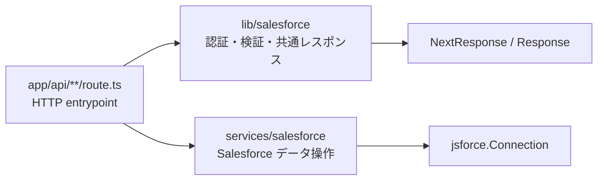

# API Route 構成

## 目的

このドキュメントは、`app/api` 配下の Route Handler がどの責務を持ち、どの処理を `lib/salesforce` と `services/salesforce` に委譲するかを整理します。

API のリクエスト / レスポンス仕様や項目ごとの詳細は [API 概要](../api/api-overview.md) を参照してください。このドキュメントでは、Route 構成と責務境界を中心に扱います。

## 全体方針

API Routes は HTTP entrypoint として、HTTP method、URL params、query、request header、request body を受け取る入口にします。Salesforce OAuth、session、入力検証、Origin / Referer 検証、エラー変換などの共通処理は `lib/salesforce` に置き、`jsforce.Connection` を使う Salesforce データ操作は `services/salesforce` に置きます。

## Route 一覧

| Route | Method | Route の主な責務 | 主な委譲先 |
| --- | --- | --- | --- |
| `/api/session` | `GET` | session Cookie を読み、接続メタデータだけを JSON で返す | `getSession()` |
| `/api/auth/login` | `GET` | OAuth 設定を読み、state を生成して Cookie に保存し、Salesforce 認可 URL へ redirect する | `getSalesforceConfig()`, `createOauthState()`, `buildAuthorizationUrl()`, `setStateCookie()` |
| `/api/auth/callback` | `GET` | `code` / `state` と state Cookie を検証し、token 交換後に session Cookie を保存する | `exchangeCodeForToken()`, `clearStateCookie()`, `setSessionCookie()` |
| `/api/auth/logout` | `POST` | Origin / Referer を検証し、token revoke を試行して session / state Cookie を削除する | `assertSameOriginRequest()`, `getSession()`, `revokeSalesforceSession()`, `clearSessionCookie()`, `clearStateCookie()` |
| `/api/accounts` | `GET` | Account 一覧取得の入口 | `handleSalesforceRoute()`, `listAccounts()` |
| `/api/accounts` | `POST` | Origin / Referer と request body を検証し、Account 作成へ委譲する | `handleSalesforceCreateRoute()`, `readAccountCreatePayload()`, `createAccount()` |
| `/api/accounts/[id]` | `PATCH` | Origin / Referer、Account ID、request body を検証し、Account 更新へ委譲する | `handleSalesforceUpdateRoute()`, `readAccountUpdatePayload()`, `updateAccount()` |
| `/api/accounts/[id]` | `DELETE` | Origin / Referer と Account ID を検証し、Account 削除へ委譲する | `handleSalesforceDeleteRoute()`, `deleteAccount()` |
| `/api/contacts` | `GET` | Contact 一覧取得の入口 | `handleSalesforceRoute()`, `listContacts()` |
| `/api/contacts` | `POST` | Origin / Referer と request body を検証し、Contact 作成へ委譲する | `handleSalesforceCreateRoute()`, `readContactCreatePayload()`, `createContact()` |
| `/api/contacts/[id]` | `PATCH` | Origin / Referer、Contact ID、request body を検証し、Contact 更新へ委譲する | `handleSalesforceUpdateRoute()`, `readContactUpdatePayload()`, `updateContact()` |
| `/api/contacts/[id]` | `DELETE` | Origin / Referer と Contact ID を検証し、Contact 削除へ委譲する | `handleSalesforceDeleteRoute()`, `deleteContact()` |
| `/api/search` | `GET` | `q` query を検証し、Account / Contact 検索へ委譲する | `handleSalesforceRoute()`, `searchAccountsAndContacts()` |
| `/api/integration/accounts` | `POST` | `x-integration-api-key` と request body を検証し、連携用ユーザーで Account 作成へ委譲する | `assertIntegrationApiKey()`, `readAccountCreatePayload()`, `createIntegrationAccount()` |
| `/api/integration/accounts/[id]` | `PATCH` | `x-integration-api-key`、Account ID、request body を検証し、連携用ユーザーで Account 更新へ委譲する | `assertIntegrationApiKey()`, `assertSalesforceRecordId()`, `readAccountUpdatePayload()`, `updateIntegrationAccount()` |
| `/api/integration/ui/accounts` | `POST` | Origin / Referer と接続 session を検証し、Integration タブからの Account 作成へ委譲する | `assertSameOriginRequest()`, `getSession()`, `readAccountCreatePayload()`, `createIntegrationAccount()` |

## 共通 handler

通常の Playground API は `lib/salesforce/route-handler.ts` の共通 handler を使います。

| 関数 | 用途 |
| --- | --- |
| `handleSalesforceRoute()` | Salesforce session を返す service result を JSON response に変換し、必要に応じて session Cookie を再セットする |
| `handleSalesforceCreateRoute()` | Origin / Referer 検証、payload 読み取り、作成処理、`201` response をまとめる |
| `handleSalesforceUpdateRoute()` | URL params の `id` 取得、Origin / Referer 検証、Salesforce record ID 検証、payload 読み取り、更新処理をまとめる |
| `handleSalesforceDeleteRoute()` | URL params の `id` 取得、Origin / Referer 検証、Salesforce record ID 検証、削除処理をまとめる |
| `handleSalesforceIntegrationRoute()` | Cookie session を前提にしない Integration API の JSON response とエラー変換をまとめる |

通常の Account / Contact API は、service 層が `{ data, session }` を返し、`handleSalesforceRoute()` が `jsonWithSession()` で response と session Cookie 更新を行います。Integration API は refresh token を持つ画面 session とは別の Client Credentials Flow を使うため、`handleSalesforceIntegrationRoute()` で Cookie session 更新を行いません。

## 検証責務

| 検証対象 | 配置 | 主な利用 Route |
| --- | --- | --- |
| OAuth state | `app/api/auth/callback/route.ts`, `lib/salesforce/session.ts` | `/api/auth/callback` |
| Origin / Referer | `lib/salesforce/request-security.ts` | `POST /api/accounts`, `PATCH /api/accounts/[id]`, `DELETE /api/accounts/[id]`, Contact mutation、logout、Integration UI |
| Salesforce record ID | `lib/salesforce/request-security.ts` | `PATCH` / `DELETE` の `[id]` route、Integration Account update |
| Account / Contact payload | `lib/salesforce/request-payloads.ts`, `lib/salesforce/record-fields.ts` | Account / Contact create / update、Integration Account create / update |
| Integration API key | `lib/salesforce/integration-security.ts` | `/api/integration/accounts`, `/api/integration/accounts/[id]` |
| 検索 query | `app/api/search/route.ts` | `/api/search` |

Route Handler は検証の順序も持ちます。state 変更系の画面 API では、Origin / Referer を先に検証してから payload を読みます。`[id]` route では URL params の `id` を取り出し、Origin / Referer と Salesforce record ID を検証してから payload 読み取りや service 呼び出しへ進みます。

## `lib` と `services` の境界

| 層 | 置くもの | 置かないもの |
| --- | --- | --- |
| `app/api` | HTTP method、redirect、query / params の取り出し、Route ごとの検証順序、共通 handler の呼び出し | Salesforce CRUD 本体、OAuth request 組み立ての重複実装、Cookie 暗号化の詳細 |
| `lib/salesforce` | OAuth、session、config、入力検証、Origin / Referer 検証、ID 検証、API key 検証、共通 response / error 変換 | `jsforce.Connection` を使う Account / Contact の SOQL や sObject CRUD |
| `services/salesforce` | `jsforce.Connection` 作成、access token refresh 後の再試行、Client Credentials Flow の Connection 作成、Account / Contact の SOQL と CRUD | HTTP request / response の組み立て、Origin / Referer 検証、request body の許可フィールド判定 |

この境界は [Salesforce 接続責務を lib と services に分離する](../decisions/2026-06-02-salesforce-connection-boundaries.md) の決定に従います。

## テスト対応

| テストファイル | 主な確認内容 |
| --- | --- |
| `app/api/auth-routes.test.ts` | session、login、callback、logout の Route 挙動、secret / token 非露出、state 検証 |
| `app/api/salesforce-routes.test.ts` | Account / Contact / search Route の service 呼び出し、Origin / Referer と ID 検証、response status |
| `app/api/integration-routes.test.ts` | Integration API key、Integration UI の same-origin と session 検証、連携用 Account create / update |
| `lib/salesforce/request-payloads.test.ts` | Account / Contact payload の許可フィールド、必須項目、正規化 |
| `lib/salesforce/request-security.test.ts` | Origin / Referer と Salesforce record ID 検証 |
| `lib/salesforce/integration-security.test.ts` | `x-integration-api-key` 検証 |
| `services/salesforce/records.test.ts` | Salesforce SOQL、sObject CRUD、Connection 作成と refresh 後の再試行 |

Route 構成を変更する場合は、変更した Route に対応する `app/api/*-routes.test.ts` と、共通処理を変更した場合の `lib/salesforce/*.test.ts` を確認します。

## 関連ドキュメント

- [API 概要](../api/api-overview.md)
- [システム概要](system-overview.md)
- [ディレクトリ構成](directory-structure.md)
- [OAuth フロー](../security/oauth-flow.md)
- [Salesforce 接続責務を lib と services に分離する](../decisions/2026-06-02-salesforce-connection-boundaries.md)
