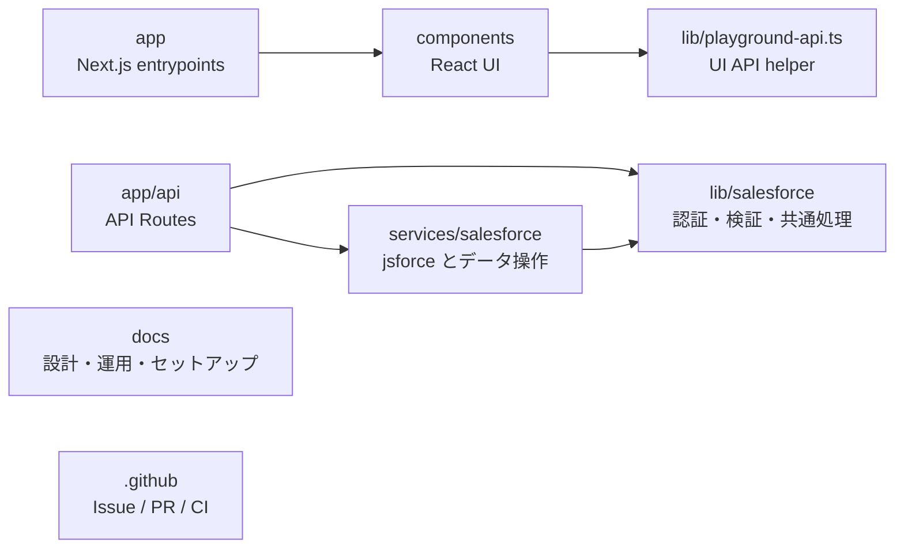

# ディレクトリ構成

## 目的

このドキュメントは、`salesforce-api-playground` の各ディレクトリと主要なルート直下ファイルの役割を整理し、開発時に「どこへ実装やドキュメントを置くか」を判断するための設計情報として管理します。

実装や既存ドキュメントから確認できる内容を中心に記載します。コードから確認できない運用や将来方針は推測せず、必要に応じて `未確認` として扱います。

## 全体方針

このリポジトリは Next.js App Router のアプリケーションとして、画面、API Routes、共通ライブラリ、Salesforce サービス層、ドキュメント、GitHub 運用設定を分けて管理します。

## 主要ディレクトリ

| パス | 目的 | 主な責務 | 置かないもの |
| --- | --- | --- | --- |
| `app` | Next.js App Router のエントリポイント | ルートページ、レイアウト、グローバル CSS、API Routes | Salesforce 接続の詳細実装、再利用 UI の大きな実装 |
| `app/api` | HTTP API のエントリポイント | OAuth、session、Account / Contact、検索、Integration API の Route Handler | Salesforce CRUD の実体、Cookie 暗号化や入力検証の重複実装 |
| `components` | React UI コンポーネント | Playground 画面全体と UI 部品 | サーバー専用処理、Salesforce API 直接呼び出し |
| `components/playground` | Playground UI の分割コンポーネント | ヘッダー、ナビゲーション、一覧、詳細、フォーム、モーダル、通知、UI hooks | API Route、Salesforce サービス層の処理 |
| `lib` | アプリケーション共通ライブラリ | UI/API 共通 helper、環境ラベル、サーバーログ | 外部 API のデータ操作本体 |
| `lib/salesforce` | Salesforce 関連の共通処理 | OAuth、session、config、入力検証、Origin / Referer 検証、エラー変換、型定義 | `jsforce.Connection` を使ったレコード CRUD の本体 |
| `services` | 外部サービスとのデータ操作層 | 外部 API 接続を使うサービス実装 | HTTP Route Handler、React UI |
| `services/salesforce` | Salesforce データ操作層 | `jsforce.Connection` 作成、access token refresh 後の再試行、Account / Contact の SOQL と CRUD | Cookie session の暗号化、OAuth URL 組み立て、request payload 検証 |
| `docs` | 開発者向け一次情報 | 設計、API、セットアップ、運用、デプロイ、セキュリティ、ナレッジ、意思決定記録 | GitHub Releases として管理すべき正式なリリースノート |
| `.github` | GitHub 上の運用設定 | Issue template、PR template、GitHub Actions、Dependabot、補助 scripts | アプリケーション実装 |
| `public` | Next.js の静的ファイル置き場 | ブラウザへそのまま配信する静的 asset | npm package で管理する SLDS assets の手動コピー |

## `app`

`app` は Next.js App Router のルートです。

| パス | 役割 |
| --- | --- |
| `app/page.tsx` | `Playground` コンポーネントを表示するトップページ |
| `app/layout.tsx` | アプリ全体の layout と metadata |
| `app/globals.css` | SLDS CSS の読み込みとアプリ全体の CSS |
| `app/api/**/route.ts` | API Routes |
| `app/api/*-routes.test.ts` | API Routes の Vitest テスト |
| `app/api/test-helpers.ts` | API route テスト用 helper |

`app/api` は HTTP メソッドごとの入口として扱います。Salesforce OAuth、session、入力検証、共通エラーハンドリングは `lib/salesforce`、Salesforce への実データ操作は `services/salesforce` に委譲します。

## `components`

`components` は UI 実装の置き場です。`components/Playground.tsx` が接続状態、データ取得、タブ遷移、作成 / 更新 / 削除、通知、モーダル状態を束ね、`components/playground` 配下の部品を組み立てます。

| パス | 役割 |
| --- | --- |
| `components/Playground.tsx` | Playground 画面全体の状態管理と UI 構成 |
| `components/playground/LoginPage.tsx` | 未接続時の Salesforce 接続導線 |
| `components/playground/GlobalHeader.tsx` | 接続後のグローバルヘッダー、検索、ログアウト |
| `components/playground/Navigation.tsx` | 主要タブのナビゲーション |
| `components/playground/ObjectHome.tsx` | ホーム、オブジェクトホーム、Integration タブのヘッダー |
| `components/playground/RecordLists.tsx` | Account / Contact 一覧 |
| `components/playground/RecordPages.tsx` | Account / Contact 詳細 |
| `components/playground/Forms.tsx` | Account / Contact フォーム |
| `components/playground/Modal.tsx` | 作成 / 編集 / 削除確認モーダル |
| `components/playground/NoticeBanner.tsx` | success / error / loading 通知 |
| `components/playground/api.ts` | UI から API を呼ぶ helper と UI 表示向けエラー |
| `components/playground/mutations.ts` | 作成 / 更新 / 削除など UI 操作の request 組み立て |
| `components/playground/usePlaygroundData.ts` | session、Account、Contact、検索結果の取得状態 |
| `components/playground/useNotice.ts` | 通知 state と自動クローズ |
| `components/playground/types.ts` | UI state 用の型 |

UI / CSS は SLDS の標準コンポーネントとユーティリティを優先します。SLDS の CSS と assets は npm dependency の `@salesforce-ux/design-system` から利用し、公式リソースを手作業でコピーして固定化しません。

## `lib`

`lib` は特定の画面や Route Handler に閉じない共通処理の置き場です。

| パス | 役割 |
| --- | --- |
| `lib/playground-api.ts` | UI と API の path、request 型、response 型、request builder |
| `lib/environment-label.ts` | `APP_ENV` / `APP_ENV_LABEL` から画面表示用の環境ラベルを決定 |
| `lib/server-log.ts` | サーバー側ログ出力前のエラー sanitization |
| `lib/salesforce` | Salesforce 関連の共通処理 |

`lib/salesforce` は Salesforce 連携のうち、HTTP route とサービス層の両方から使う共通処理を持ちます。

| パス | 役割 |
| --- | --- |
| `lib/salesforce/api-version.ts` | Salesforce API version の唯一の定義元 |
| `lib/salesforce/config.ts` | Salesforce OAuth / Integration 用環境変数の読み取りと検証 |
| `lib/salesforce/client-core.ts` | OAuth URL、token request、Salesforce error payload 変換の純粋処理 |
| `lib/salesforce/client.ts` | token exchange、refresh、revoke、Client Credentials token 交換、API error response |
| `lib/salesforce/session.ts` | OAuth state と暗号化 HttpOnly session Cookie |
| `lib/salesforce/request-security.ts` | Origin / Referer 検証と Salesforce record ID 検証 |
| `lib/salesforce/request-payloads.ts` | Account / Contact request payload の検証と正規化 |
| `lib/salesforce/record-fields.ts` | Account / Contact で許可するフィールド定義 |
| `lib/salesforce/records.ts` | Account / Contact / Search の型定義 |
| `lib/salesforce/route-handler.ts` | Salesforce API Route の共通レスポンス / エラーハンドリング |
| `lib/salesforce/integration-security.ts` | `x-integration-api-key` の検証 |
| `lib/salesforce/error-sanitizer.ts` | token / secret 系の値をログやエラー詳細からマスク |
| `lib/salesforce/urls.ts` | 設定済みアプリ origin の取得 |

## `services`

`services` は外部サービスに対するデータ操作を集約する層です。現在は `services/salesforce` のみがあります。

| パス | 役割 |
| --- | --- |
| `services/salesforce/client.ts` | `jsforce.Connection` 作成、未接続検出、access token refresh 後の再試行、連携用 Connection 作成 |
| `services/salesforce/records.ts` | Account / Contact の SOQL、create、update、delete、検索 |
| `services/salesforce/records.test.ts` | Salesforce レコード操作のテスト |

新しい Salesforce データ操作は、HTTP 入口を `app/api`、入力検証や共通処理を `lib/salesforce`、実際の `jsforce.Connection` を使った操作を `services/salesforce` に分けます。

## `docs`

`docs` は開発者向け一次情報です。README は入口として簡潔に保ち、詳細は `docs` 配下へ置きます。

| パス | 役割 |
| --- | --- |
| `docs/index.md` | GitHub Pages ドキュメントサイトの入口 |
| `docs/architecture` | システム構成、UI flow、ディレクトリ構成などの設計情報 |
| `docs/api` | API Routes と Salesforce API 連携の仕様 |
| `docs/security` | OAuth flow、秘密情報の扱いなどセキュリティ関連の設計 |
| `docs/setup` | ローカル開発、Salesforce 設定、手動確認 |
| `docs/deployment` | Heroku デプロイと運用確認 |
| `docs/operations` | GitHub 運用、CI、トラブルシューティング |
| `docs/knowledge` | 開発手法、概念理解、比較、学習メモ |
| `docs/decisions` | 意思決定記録 |
| `docs/images` | docs で使う画像の置き場 |
| `docs/_config.yml` | GitHub Pages / Jekyll 用設定 |

リリースノートは GitHub Releases で管理します。個別の変更履歴を `CHANGELOG.md` に追記する運用にはしません。

## `.github`

`.github` は GitHub 上の運用設定を管理します。

| パス | 役割 |
| --- | --- |
| `.github/ISSUE_TEMPLATE` | 不具合、改善、ドキュメント、学習 TODO の Issue template |
| `.github/pull_request_template.md` | PR 本文テンプレート |
| `.github/workflows` | CI、auto assign などの GitHub Actions |
| `.github/scripts` | GitHub Actions などから使う補助 script |
| `.github/dependabot.yml` | Dependabot 設定 |
| `.github/release.yml` | GitHub Releases 用設定 |

workflow を変更する場合は `npm run workflows:check` で YAML parse を確認します。

## `public`

`public` は Next.js が静的ファイルをそのまま配信するための置き場です。現時点では配下に管理対象ファイルはありません。

SLDS の CSS と assets は npm dependency の `@salesforce-ux/design-system` から利用します。SLDS 由来の画像や CSS を `public` へ手作業でコピーして固定化する運用にはしません。

## ルート直下の主要ファイル

| パス | 役割 |
| --- | --- |
| `README.md` | プロジェクト入口、概要、セットアップ、主要 docs への導線 |
| `AGENTS.md` | Codex / エージェント作業時のルール |
| `package.json`, `package-lock.json` | npm 依存関係、scripts、Node.js / npm version 条件 |
| `next.config.mjs` | Next.js 設定 |
| `tsconfig.json`, `tsconfig.typecheck.json` | TypeScript 設定 |
| `eslint.config.mjs` | ESLint 設定 |
| `slds-linter.eslint.config.mjs` | SLDS Linter 設定 |
| `vitest.config.ts` | Vitest と coverage threshold 設定 |
| `.env.example` | ローカル環境変数のサンプル |
| `app.json` | Heroku Button 用 app 定義 |
| `Procfile` | Heroku 上の起動コマンド |
| `.gitignore` | Git 管理しないファイル |
| `.gitattributes` | Git 属性設定 |
| `LICENSE` | ライセンス |
| `CHANGELOG.md` | 現在の README では GitHub Releases を正式な変更履歴として扱うため、個別変更履歴の追記先にはしない |

`.env.local`、`.env`、`.env.*`、`.next`、`coverage`、`node_modules`、`*.tsbuildinfo` はローカル生成物または秘密情報を含み得るファイルとして扱い、通常コミット対象にしません。

## 配置判断の目安

| 追加したいもの | 置き場所 |
| --- | --- |
| 新しい画面部品 | `components/playground` |
| 画面全体の状態管理変更 | `components/Playground.tsx` または `components/playground/use*.ts` |
| ブラウザから呼ぶ新しい API | `app/api/**/route.ts` |
| API request payload の検証 | `lib/salesforce/request-payloads.ts` または関連する `lib/salesforce/*` |
| Salesforce の新しい CRUD / SOQL | `services/salesforce` |
| Salesforce OAuth / session / config の共通処理 | `lib/salesforce` |
| UI と API の request / response 型や path | `lib/playground-api.ts` |
| 開発手順や運用手順 | `docs/setup`、`docs/operations`、`docs/deployment` |
| システム構成や責務境界 | `docs/architecture` または `docs/decisions` |
| token、secret、実 URL、placeholder の扱い | `docs/security` |
| 学習メモや比較 | `docs/knowledge` |
| Issue / PR / CI の運用設定 | `.github` |

## 関連ドキュメント

- [システム概要](system-overview.md)
- [API 概要](../api/api-overview.md)
- [Playground UI 操作フロー棚卸し](playground-ui-flows.md)
- [環境ラベル](environment-label.md)
- [秘密情報の扱い](../security/secret-handling.md)
- [Salesforce 接続責務を lib と services に分離する](../decisions/2026-06-02-salesforce-connection-boundaries.md)
- [ローカル開発](../setup/local-development.md)
- [GitHub 運用](../operations/github.md)
