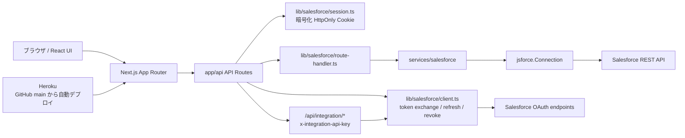
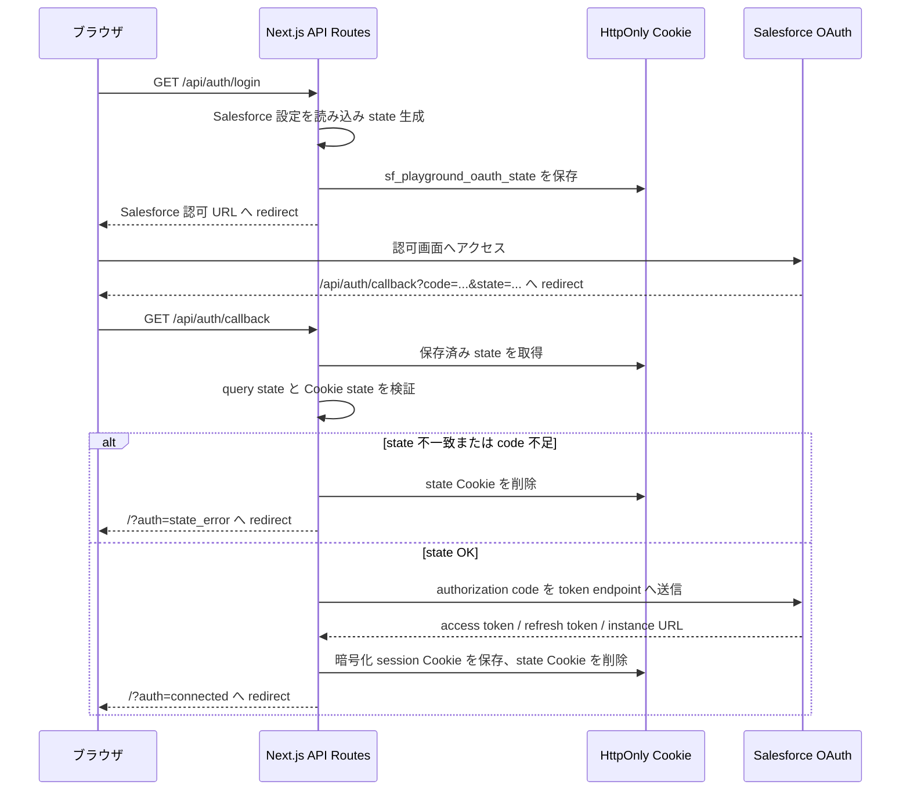
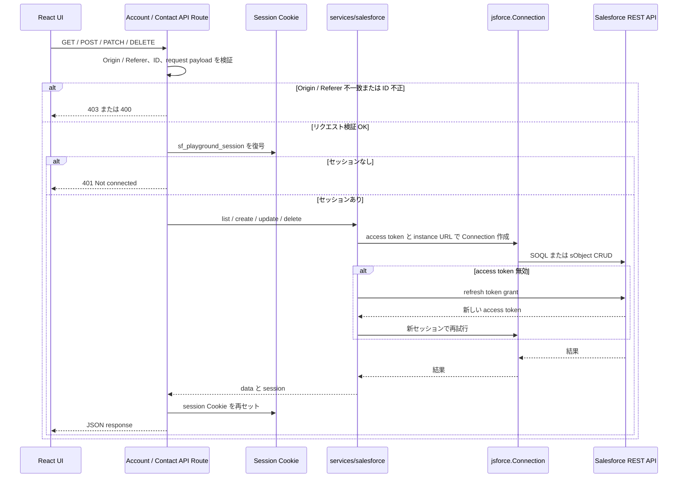

# システム概要

## 目的

このドキュメントは、`salesforce-api-playground` の全体構成、主要コンポーネント、外部連携の関係を開発者が把握するための一次情報として管理します。

## 概要

このアプリケーションは、Salesforce OAuth 2.0 Authorization Code Flow、Client Credentials Flow、Salesforce REST API を検証するための Next.js アプリです。アプリ側に DB は持たず、Salesforce の Account / Contact データを API 経由で直接操作します。

Client Secret、access token、refresh token はブラウザへ出しません。OAuth callback 後に作成したセッションを AES-256-GCM で暗号化し、HttpOnly Cookie に保存します。refresh token は DB やファイルへ永続保存しません。

## システム構成

## 主要コンポーネント

| 領域 | 配置 | 実装から確認できる責務 |
| --- | --- | --- |
| ページ | `app/page.tsx` | Playground UI の表示 |
| レイアウト / CSS | `app/layout.tsx`, `app/globals.css` | Next.js レイアウト、SLDS CSS 読み込み |
| UI コンポーネント | `components/Playground.tsx`, `components/playground/*` | 接続状態表示、Account / Contact の一覧、フォーム、モーダル、通知 |
| UI API helper | `lib/playground-api.ts`, `components/playground/api.ts` | API path 定義、fetch request 作成、エラー表示用変換 |
| API Routes | `app/api/**/route.ts` | OAuth、session、Account / Contact CRUD の HTTP エントリポイント |
| Salesforce session | `lib/salesforce/session.ts` | Cookie 暗号化、復号、state 生成、Cookie set / clear |
| Salesforce OAuth | `lib/salesforce/client.ts`, `lib/salesforce/client-core.ts` | authorization URL、token exchange、refresh、revoke、Salesforce エラー変換 |
| Salesforce service | `services/salesforce/client.ts` | `jsforce.Connection` 作成、未接続検出、access token refresh 後の再試行、連携用ユーザーの Connection 作成 |
| Salesforce records | `services/salesforce/records.ts` | Account / Contact の SOQL、create、update、delete |
| 入力検証 | `lib/salesforce/request-payloads.ts`, `lib/salesforce/record-fields.ts` | 許可フィールド、必須フィールド、文字列 / null の検証 |
| 連携 API 保護 | `lib/salesforce/integration-security.ts` | `x-integration-api-key` と `INTEGRATION_API_KEY` の照合 |

## OAuth フロー

## Account / Contact 操作フロー

## データ操作の概要

Account / Contact は `services/salesforce/records.ts` で標準オブジェクトとして操作します。現在の一覧取得はそれぞれ `LastModifiedDate DESC`、`LIMIT 100` です。

| 操作 | Account | Contact |
| --- | --- | --- |
| 一覧 | `SELECT Id, Name, Phone, Website, Industry, Type, BillingCity, BillingCountry, LastModifiedDate FROM Account ...` | `SELECT Id, FirstName, LastName, Email, Phone, Title, AccountId, Account.Name, LastModifiedDate FROM Contact ...` |
| 作成 | `connection.sobject("Account").create(input)` | `connection.sobject("Contact").create(input)` |
| 更新 | `connection.sobject("Account").update({ Id: id, ...input })` | `connection.sobject("Contact").update({ Id: id, ...input })` |
| 削除 | `connection.sobject("Account").destroy(id)` | `connection.sobject("Contact").destroy(id)` |

`POST` / `PATCH` / `DELETE` は `Origin` または `Referer` の origin が `SALESFORCE_REDIRECT_URI` の origin と一致する場合のみ処理します。`PATCH` / `DELETE` の ID は 15 桁または 18 桁の英数字で、Account は `001`、Contact は `003` prefix のみ許可します。

API route 独自の rate limit は未実装です。このアプリは個人用 / 検証用 playground として扱い、公開範囲や利用者数を広げるまではアプリ内 rate limit を運用要件にしません。

## セッション Cookie

| Cookie | 用途 | 保存内容 | maxAge |
| --- | --- | --- | --- |
| `sf_playground_oauth_state` | OAuth state 検証 | ランダム state 文字列 | 10 分 |
| `sf_playground_session` | Salesforce 接続セッション | AES-256-GCM で暗号化した `accessToken`, `refreshToken`, `instanceUrl`, `issuedAt`, `userId`, `organizationId?` | 8 時間 |

Cookie 属性は `httpOnly: true`、`sameSite: "lax"`、`path: "/"` です。`secure` は `NODE_ENV === "production"` の場合に有効です。

## 環境変数

`lib/salesforce/config.ts` が参照する環境変数は以下です。

| 変数 | 必須 | 既定値 | 用途 |
| --- | --- | --- | --- |
| `SALESFORCE_CLIENT_ID` | 必須 | なし | OAuth client id |
| `SALESFORCE_CLIENT_SECRET` | 必須 | なし | OAuth client secret |
| `SALESFORCE_REDIRECT_URI` | 必須 | なし | OAuth callback URL |
| `SALESFORCE_LOGIN_URL` | 任意 | `https://login.salesforce.com` | Salesforce login / token endpoint の基点 |
| `SESSION_SECRET` | 必須 | なし | Cookie 暗号化キーの元文字列。32 文字以上必須 |
| `SALESFORCE_INTEGRATION_CLIENT_ID` | 連携 API 利用時は必須 | なし | Client Credentials Flow 用 OAuth client id |
| `SALESFORCE_INTEGRATION_CLIENT_SECRET` | 連携 API 利用時は必須 | なし | Client Credentials Flow 用 OAuth client secret |
| `SALESFORCE_INTEGRATION_LOGIN_URL` | 連携 API 利用時は必須 | なし | 連携用 token endpoint の基点。Client Credentials Flow では My Domain URL を指定する |
| `INTEGRATION_API_KEY` | 連携 API 利用時は必須 | なし | `/api/integration/*` の呼び出し元検証用共有鍵 |

Salesforce API version は環境変数ではなく、`lib/salesforce/api-version.ts` の `DEFAULT_SALESFORCE_API_VERSION` を唯一の定義元として管理します。`jsforce.Connection` には `toJsforceApiVersion()` で先頭 `v` を除いた値を渡します。

## 補足

- Salesforce 組織ごとの validation rule、権限、参照整合性、必須項目追加による挙動は、組織設定に依存します。API エラー表示方針と rate limit 方針は [API 概要](../api/api-overview.md) と [トラブルシューティング](../operations/troubleshooting.md) を参照。
- `organizationId` は OAuth token response の `id` URL から session に保存します。レスポンスや API 呼び出しには使用していません。
- Heroku release と GitHub merge commit の対応、dyno 起動状態、ロールバック手順の確認観点は [Heroku デプロイ](../deployment/heroku.md) を参照。

## 関連ドキュメント

- [API 概要](../api/api-overview.md)
- [OAuth フロー](../security/oauth-flow.md)
- [Heroku デプロイ](../deployment/heroku.md)
- [ローカル開発](../setup/local-development.md)
