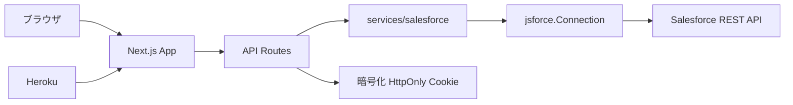

# システム概要

## 目的

このドキュメントは、`salesforce-api-playground` の全体構成、主要コンポーネント、外部連携の関係を開発者が把握するための一次情報として管理します。

## 概要

このアプリケーションは、Salesforce OAuth 2.0 Authorization Code Flow と Salesforce REST API を検証するための Next.js アプリです。アプリ側に DB は持たず、Salesforce の Account / Contact データを API 経由で直接操作します。

現時点で実装から確認できる主な構成は以下です。

- UI: `app` / `components`
- API Routes: `app/api`
- Salesforce 関連処理: `lib/salesforce` / `services/salesforce`
- セッション管理: 暗号化した HttpOnly Cookie
- デプロイ想定: Heroku

## 前提条件

- Node.js 20 以上 23 未満
- npm 10 以上
- Salesforce Developer Edition、Trailhead ハンズオン組織、または検証用 Salesforce 組織
- Salesforce 外部クライアントアプリケーション
- ローカルまたは Heroku の環境変数設定

## 手順

1. 新しい構成要素を追加した場合は、このドキュメントに責務と配置場所を追記する。
2. 外部連携やデータフローが変わる場合は Mermaid 図を更新する。
3. 実装から確認できない内容は `未確認` または `TODO` として残す。

## 注意事項

- 実 Salesforce 接続の動作確認結果や実 URL は記載しない。
- 秘密情報、トークン、Client Secret は記載しない。
- 推測で仕様を書かず、コードまたは運用ルールから確認できる内容を記載する。

## TODO

- 主要コンポーネントごとの責務を詳細化する。
- OAuth callback からセッション保存までの詳細シーケンス図を追加する。
- Account / Contact 操作のデータフローを追加する。

## 関連ドキュメント

- [API 概要](../api/api-overview.md)
- [OAuth フロー](../security/oauth-flow.md)
- [Heroku デプロイ](../deployment/heroku.md)
- [ローカル開発](../setup/local-development.md)
